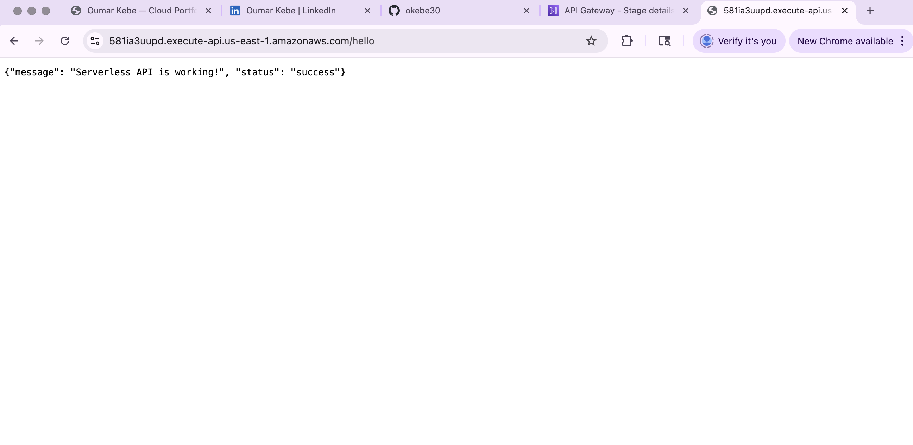
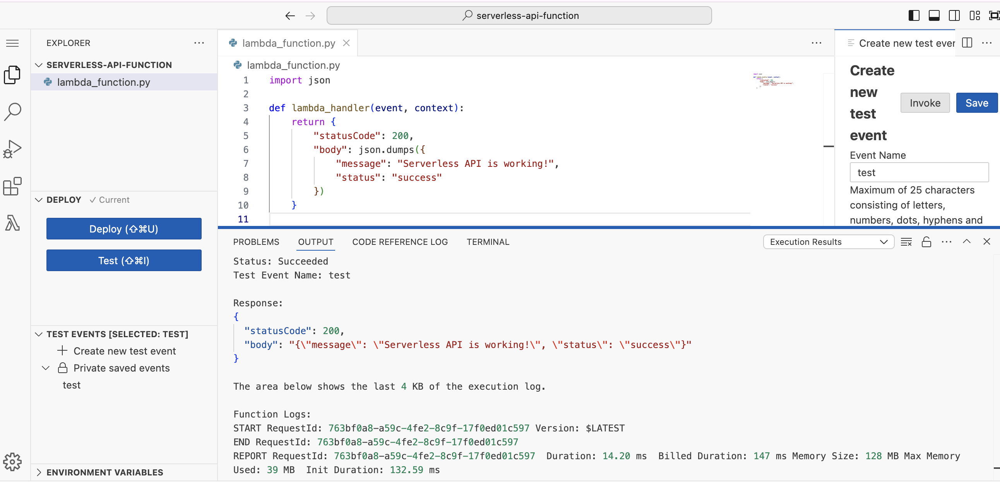

# AWS Serverless API Project

This project demonstrates a simple serverless REST API built using AWS services.

## Architecture
- AWS Lambda (Python)
- Amazon API Gateway (HTTP API)
- IAM Role for Lambda execution

## Features
- Serverless API endpoint
- GET route returning JSON response
- Deployed using API Gateway with automatic deployment

## API Endpoint
GET /hello

Example:
https://581ia3uupd.execute-api.us-east-1.amazonaws.com/hello
## Screenshots

### Lambda Function (Python)

### API Gateway Route

### API Response in Browser

# AWS Serverless API Project

This project demonstrates a simple serverless REST API built using AWS services.

## Architecture
- AWS Lambda (Python)
- Amazon API Gateway (HTTP API)
- IAM Role for Lambda execution

## Features
- Serverless API endpoint
- GET route returning JSON response
- Automatic deployment using API Gateway

## Screenshots

### Lambda Function Test

### API Gateway Route

### API Gateway Stage

### Browser Test

